# claude-skills-journalism-tw

[]（https://github.com/richardvt/claude-skills-journalism-tw/releases/tag/v1.0.0）
[]（LICENSE）
[]（#已在地化-skill13-個--100-完成）

**給台灣新聞工作者、編輯、查核員、自由記者使用的 Claude Code Plugin。**

這是一組繁體中文 / 台灣在地化的 journalism skills，涵蓋政資法申請、事實查核、來源驗證、AI 味清理、台灣編務規範、採訪準備、逐字稿、資料新聞、電子報發行與投稿 pitch。

> **致謝**：本 repo 改寫自 [Joe Amditis](https://github.com/jamditis) 的 [claude-skills-journalism](https://github.com/jamditis/claude-skills-journalism)，並針對台灣法規、媒體平台、查核機構與編務慣例**大幅重寫**（約 70–80% 內容為台灣場景重新撰寫，而非翻譯）。詳見「[與 upstream 英文版的主要差異](#與-upstream-英文版的主要差異)」。

## 適合用在

- 編輯部日常出稿與校稿
- 調查報導資料蒐集
- LINE 假訊息查核
- 台灣政府資料申請（政資法）
- 自由記者投稿提案
- 突發新聞應變 SOP
- 跨平台 OSINT 與深偽偵測
- 新聞產品 / 教育訓練 / 媒體素養工作坊

## 新聞生命週期

13 個 skill 涵蓋從**選題**到**發布後追蹤**之完整新聞生產流程：

```mermaid
flowchart LR
  A[選題 Pitch<br/>story-pitch-tw] --> B[資料蒐集]
  B --> B1[政資法申請<br/>foia-requests-tw]
  B --> B2[OSINT 追蹤<br/>social-media-<br/>intelligence-tw]
  B1 & B2 --> C[來源驗證<br/>source-verification-tw]
  C --> D[採訪準備<br/>interview-prep-tw]
  D --> E[錄音轉錄<br/>interview-<br/>transcription-tw]
  E --> F[事實查核<br/>fact-check-workflow-tw]
  F --> G[去 AI 寫作味<br/>ai-writing-detox-tw]
  G --> H[編務校對<br/>newsroom-style-tw]
  H --> I[三層審核<br/>editorial-<br/>workflow-tw]
  I --> J[發布]
  J --> K[資料新聞<br/>data-journalism-tw]
  J --> L[電子報<br/>newsletter-<br/>publishing-tw]
  J --> M[突發應變<br/>crisis-<br/>communications-tw]
  K & L & M --> N[KPI / 後續追蹤]

  style A fill:#fef3c7
  style J fill:#dcfce7
  style N fill:#dbeafe
```



> 突發新聞情境（地震、食安、政治事件）會**跳過部分順序**，由 `crisis-communications-tw` 主導，並在前 15 分鐘內整合 `fact-check-workflow-tw` + `source-verification-tw` 做快速查證。

## 重要聲明

本 repo 內容**僅供新聞工作、編輯流程、查核流程與資料蒐集參考，不構成法律意見**。

涉及《政府資訊公開法》、《個資法》、《刑法》、《選舉罷免法》、《通訊保障及監察法》等法律內容時，請以**全國法規資料庫**（law.moj.gov.tw）、**主管機關公告**與**專業法律意見**為準。

各 skill 內容均附有「截至 YYYY-MM-DD」標記，但法規、平台政策、媒體投稿規範可能隨時變動。發稿前涉重大法律議題請洽律師或本社法務。

## 30 秒快速安裝

在 Claude Code 裡執行：

```bash
/plugin marketplace add richardvt/claude-skills-journalism-tw
/plugin install journalism-core-tw@claude-skills-journalism-tw
/reload-plugins
```

裝完後**不需要手動呼叫 skill**。直接用自然語言描述新聞任務，Claude 會自動選用對應的台灣版 skill。

> 其他安裝方式（本機路徑 / 手動複製）見下方 [#安裝方式](#安裝方式) 章節。

## Demo：AI 寫作味改寫前後

### 你貼給 Claude

```text
這段新聞幫我去 AI 味,改成台灣媒體可發稿版本:

在這個快速變遷的時代,食品安全議題值得我們深思。
近期食藥署不僅優化了既有的稽查制度,更通過大數據與
人工智能的深度結合,賦能每一位稽查員。值得我們深思
的是,這項變革將如何重塑我們的食品安全生態。
```

### Claude 抓出的問題（自動觸發 `ai-writing-detox-tw` + `newsroom-style-tw`）

| 問題類型 | 原文 | 改寫方向 |
|---|---|---|
| AI 套語 | 「在這個快速變遷的時代」 | 刪除整句 |
| AI 套語 | 「值得我們深思」（2 次） | 刪除 |
| 三段套路 | 「不僅...更...」 | 拆兩句寫具體事實 |
| 大陸用語 | 「通過」（透過意） | 改「**透過**」 |
| 大陸用語 | 「人工智能」 | 改「**人工智慧**」 |
| 大陸用語 | 「賦能」 | 改具體動作（「提供工具」） |
| 大陸用語 | 「優化」（PR 場景） | 改「改善」 |
| 名詞濫用 | 「食品安全生態」 | 改「食品安全環境」 |
| 設問句 | 「將如何重塑...」 | 改陳述句或具體事實 |

### Claude 改寫後

> 食藥署 2026 年 5 月 27 日宣布，擴大 AI 輔助食安稽查；
> 預計新增 80 個跨縣市稽查點，並導入影像辨識協助
> 餐廳衛生查核。

**從 4 行 AI 味文字** → **2 行具體事實**；通過台灣編務規範。

> 更多範例見 [`examples/`](examples/) 資料夾。

## 測試狀態

v1.0.0 已通過**乾淨環境端到端測試**（2026-05-28）：

| 測試項目 | 結果 |
|---|---|
| plugin marketplace 安裝流程 | 通過 |
| 13/13 skill 正確載入 | 通過 |
| 與 upstream 英文版並存 | 通過（`-tw` 後綴無衝突） |
| `foia-requests-tw` 單一 skill 觸發 | 通過：正確產出政資法申請書與救濟路徑 |
| `crisis-communications-tw` 單一 skill 觸發 | 通過：正確產出 0–15 分鐘應變 SOP |
| `story-pitch-tw` 單一 skill 觸發 | 通過：正確產出媒體選擇、pitch 信、稿費估算 |
| 13 skill 完整工作流串接 | 通過：可串接選題、查核、採訪、編務、發行流程 |
| 負向測試（不該觸發時無誤觸發） | 通過 |

**關鍵觀察**：
- Claude 動筆前會主動聲明會跑哪些 skill，並在工作流各階段明確 reference 對應 skill 名稱（例如「Layer 1 自審清單跑 ai-writing-detox-tw」），驗證 plugin 設計的「協作章節」交叉參照機制可運作
- 在測試中，Claude 能結合 skill 內容與一般媒體實務知識，例如媒體商業壓力、寄信網域驗證（DKIM 與 From 對齊）、電子報開信時段等

完整測試紀錄見 [`TEST_SUITE.md`](TEST_SUITE.md)。

## 已在地化 Skill（13 個 — **100% 完成**）

| Skill | 對應 upstream | 內容重點 |
|---|---|---|
| `foia-requests-tw` | foia-requests | 《政府資訊公開法》申請流程、9 款限制公開事由、訴願與行政訴訟救濟、申請書範本、18 則行政法院判決見解 |
| `source-verification-tw` | source-verification | SIFT、C2PA、深偽偵測、台灣 2024 大選深偽真實案例、DoubleThink Lab/IORG、《選罷法》§104 加重深偽條款 |
| `social-media-intelligence-tw` | social-media-intelligence | 16 個平台跨平台 OSINT、台灣協同操作偵測（GoLaxy 案例）、敘事擴散鏈、DoubleThink Lab/IORG 研究方法 |
| `interview-prep-tw` | interview-prep | 台灣錄音法律（《刑法》§315-1、《通保法》§29 第 3 款）、8 種台灣特殊受訪對象 |
| `interview-transcription-tw` | interview-transcription | 雅婷逐字稿、台/客/原民族語、Whisper large-v3、引語資料庫 |
| `fact-check-workflow-tw` | fact-check-workflow | 台灣 4 大 IFCN 認證查核機構、LINE 訊息查證、評等 6 級制、法律風險（《刑法》§310、《社維法》§63） |
| `ai-writing-detox-tw` | ai-writing-detox | 中文 AI 寫作 pattern、中國大陸用語滲透對照表 40+ 組、四字成語堆疊、新聞文體禁忌 |
| `newsroom-style-tw` | newsroom-style | 教育部《重訂標點符號手冊》+ 行政院《公文書數字使用原則》、人名譯名（川普 vs 特朗普）、兩岸關係用語、常見錯字 |
| `crisis-communications-tw` | crisis-communications | 11 種台灣常見危機類別、突發新聞時間軸 SOP、NCC 廣電法、災害現場記者安全、誤報更正模板 |
| `data-journalism-tw` | data-journalism | 19 個台灣政府開放資料來源、台灣資料清理常見坑（縣市改制、民國/西元、編碼）、Datawrapper/g0v 等視覺化工具 |
| `editorial-workflow-tw` | editorial-workflow | 編輯部選題追蹤、稿單管理、台灣中型編輯部架構、紙本/網路/週刊/廣電差異、三層審核流程 |
| `newsletter-publishing-tw` | newsletter-publishing | 方格子等台灣本地平台、Gmail/Yahoo/Outlook 寄信合規、台灣訂閱媒體標竿、《個資法》電子報規範 |
| `story-pitch-tw` | story-pitch | 16 家台灣主流媒體投稿指南（報導者、天下、商周、READr、鏡週刊、INSIDE、關鍵評論網 等）、稿費行情、自由工作者合約注意事項 |

> 命名約定：本版 skill 一律加 `-tw` 後綴，可與 upstream 英文版**並存安裝**。
> 13 個 skill 涵蓋從**選題 pitch → 資料蒐集 → 來源驗證 → OSINT → 採訪轉錄 → 查核 → 文體 → 編務 → 突發應變 → 資料新聞 → 電子報發行 → 編輯部管理**之**完整新聞生命週期**。

## 與 upstream 英文版的主要差異

本 repo 不只翻譯 — 是**完全替換為台灣對應的法規、機構、平台與媒體生態**。

| 面向 | upstream（美國） | 本 repo（台灣） |
|---|---|---|
| **資訊公開** | FOIA（《Freedom of Information Act》）、5 U.S.C. § 552、州級 OPRA / FOIL | **《政府資訊公開法》**、§18 9 款豁免、訴願 → 行政訴訟、**18 則行政法院判決見解**（102 判 147 等） |
| **新聞文體** | AP Style（美聯社風格）、大小寫規則（sentence case） | **教育部《重訂標點符號手冊》** + **行政院《公文書數字使用原則》**；全形標點、川普 vs 特朗普、兩岸關係用語 |
| **社群平台** | X、Reddit、Facebook、Bluesky 為主 | **Threads、PTT、Dcard、LINE、FB、IG、YouTube、TikTok、微博、小紅書、抖音、WeChat** 等 16 個平台 |
| **查核機構** | PolitiFact、Snopes、FactCheck.org；6 級 IFCN 評等 | **台灣事實查核中心、MyGoPen、Cofacts、蘭姆酒吐司**（4 大 IFCN 認證）+ **LINE 訊息查證** |
| **採訪法律** | 各州 one-party / two-party consent；RCFP Reporter's Recording Guide | **《刑法》§315-1**、**《通保法》§29 第 3 款**一方同意、台灣判決見解（北院 108 自字 51 號） |
| **誹謗、散布謠言** | 美國《憲法第一修正案》、actual malice standard | **《刑法》§310 / §311**、**《社維法》§63 第 5 款散布謠言**、**《選罷法》§104 加重深偽條款** |
| **資料來源** | data.gov、Census、SEC、FOIAonline | **data.gov.tw、立法院議事公報、監察院、審計部、政府電子採購網、公開資訊觀測站、主計總處** 等 19 個 |
| **投稿** | NYT、WaPo、ProPublica、The Intercept（美國媒體 pitch）| **報導者、天下、商周、READr、鏡週刊、聯合、自由、中時、INSIDE、關鍵評論網** 等 16 家台灣媒體 |
| **深偽案例** | 美國選舉、Pope 假照 | **2024 台灣大選**：賴清德加密貨幣詐騙、賴清德藍白合變造（調查局 98.1%）、高嘉瑜 AI 仿聲、**GoLaxy 影響力作戰** |
| **資訊作戰研究** | Stanford Internet Observatory（2024 解散）、Atlantic Council DFRLab | **台灣民主實驗室 DoubleThink Lab**、**IORG**（台灣資訊環境研究中心） |
| **中文 AI 寫作味** | （英文版不適用） | **中文 AI 套語家族**（「值得我們深思」「不僅...更...」）+ **大陸用語滲透對照 40+ 組** |
| **電子報技術合規** | Gmail/Yahoo/Outlook 2024–2026 規範（全球通用） | **保留**（全球通用）+ 加台灣訂閱媒體標竿、方格子等本地平台 |

**結論**：約 **70–80% 的 skill 內容**為台灣場景重寫；其餘 20–30%（通用工具、方法論）沿用 upstream。

## 其他安裝方式

> 推薦的 30 秒安裝方式見上方 [#30-秒快速安裝](#30-秒快速安裝)；以下為**離線、開發、或不想透過 marketplace 的進階使用者**之替代方法。

### 從本機路徑安裝（開發 / 離線）

先 git clone：

```bash
git clone https://github.com/richardvt/claude-skills-journalism-tw.git ~/claude-skills-journalism-tw
```

在 Claude Code 中執行：

```text
/plugin marketplace add ~/claude-skills-journalism-tw
/plugin install journalism-core-tw@claude-skills-journalism-tw
/reload-plugins
```

### 手動複製 skill 到 ~/.claude/skills/

不透過 plugin 系統，直接把 skill 檔丟到本機 Claude skills 目錄：

```bash
git clone https://github.com/richardvt/claude-skills-journalism-tw.git
cp -r claude-skills-journalism-tw/journalism-core-tw/skills/* ~/.claude/skills/
```

> ✅ **可與 upstream 英文版並存**：本版 skill 一律加 `-tw` 後綴（例：`foia-requests-tw`），不會與 upstream 英文版 `foia-requests` 衝突。兩版本可同時安裝，用於對照比較或在不同場景觸發。Claude 會依語言（中/英）、地名、機關名等線索自動挑選對應 skill；若想強制使用特定版本，在 prompt 直接指明：「用 foia-requests-tw 幫我寫」。

## 典型使用情境（6 個常見場景）

裝完後不必手動呼叫，Claude 會在你描述相關任務時自動使用對應 skill。以下是 6 種代表性使用場景。

### 1. 記者寫政資法申請書

**情境**：你想向某政府機關取得文件，但不知道怎麼下筆。

**對 Claude 說**：
> 我要向衛福部食藥署申請過去 3 年某連鎖餐廳的衛生稽查紀錄。
> 幫我寫一份政資法申請書，預先回應可能被以 §18 拒絕的理由，
> 並準備若被拒絕的訴願主張。

**Claude 會做**：
- 觸發 `foia-requests-tw`
- 產出：完整申請書（§10 五項應載項目）+ 預先回應 §18 各款 + 訴願主張要點 + 引用最高行政法院 5+ 則判決見解 + 建議同步寄地方衛生局

---

### 2. 編輯潤稿（去 AI 味 + 編務校對）

**情境**：記者用 AI 起草了一段新聞，要改成可發稿。

**對 Claude 說**：
> 這段稿子幫我改成可發稿狀態，要去除 AI 味、改成台灣編務規範：
>
> [貼上稿件]

**Claude 會做**：
- 觸發 `ai-writing-detox-tw`：抓套語（「值得我們深思」「在這個...時代」）、大陸用語（視頻/網絡/賦能/打造）、設問句
- 觸發 `newsroom-style-tw`：校對數字（阿拉伯/中文）、譯名（川普非特朗普）、職稱、引號標點、機構名簡稱
- 產出：逐項標註問題 + 改寫後乾淨版本

---

### 3. 查核員查證 LINE 流傳訊息

**情境**：LINE 群組轉傳一則健康/政治/兩岸假訊息，你要寫成查核報導。

**對 Claude 說**：
> LINE 群組轉傳這則訊息，幫我：
> （1） 提取可查證主張並排優先級
> （2） 設計查證計畫
> （3） 評等（用台灣 6 級制）
> （4） 寫成查核報導
>
> [貼上訊息]

**Claude 會做**：
- 觸發 `fact-check-workflow-tw`：主張提取、6 級評等（正確 / 部分錯誤 / 事實釐清 / 錯誤 / 證據不足 / 未審查）
- 觸發 `source-verification-tw`：若含影像/影片，反向圖搜 + 深偽偵測
- 引用 4 大 IFCN 認證機構（台灣事實查核中心、MyGoPen、Cofacts、蘭姆酒吐司）
- 提示法律風險（《刑法》§310 誹謗、《社維法》§63 散布謠言）

---

### 4. 自由記者投稿提案

**情境**：你有一個調查報導題目，想 pitch 給台灣媒體。

**對 Claude 說**：
> 我有個食安連鎖餐廳調查報導題目，幫我：
> （1） 評估最適合 pitch 給哪 2-3 家台灣媒體
> （2） 寫 pitch 信
> （3） 估算稿費 + 採訪時間
> （4） 簽合約注意事項

**Claude 會做**：
- 觸發 `story-pitch-tw`：從 16 家台灣主流媒體（報導者、READr、鏡週刊、商周、天下…）中挑選最適合的，並說明媒體商業壓力與議題契合度
- 產出：完整 pitch 信（Hook / Why now / Stakes / Format 4 段結構）+ 稿費分項估算（主稿 + 視覺加成 + 採訪費）+ 8 點合約紅線（法律保護、線人保密、kill fee 等）
- 主動轉手 `foia-requests-tw`（若需申請政府資料）

---

### 5. 災害現場記者（突發新聞 SOP）

**情境**：剛發生地震/食安/火災/政治事件，你要做即時報導。

**對 Claude 說**：
> 花蓮外海剛發生規模 6.8 地震，LINE 已經開始流傳假災情。
> 幫我設計第 0–15 分鐘的應變 SOP、第一稿模板、現場記者安全準則。

**Claude 會做**：
- 觸發 `crisis-communications-tw`:11 種台灣常見危機類別之 SOP、突發新聞時間軸（0–15 分 / 15–60 分 / 1–6 時 / 6–24 時）
- 串接 `fact-check-workflow-tw` 處理 LINE 假訊息查證
- 提示中央氣象署（非氣象局）為唯一官方來源
- 災害現場記者安全準則（撤離條件、安全裝備、不擋救難動線）
- NCC 廣電法注意事項（死傷畫面、家屬隱私）

---

### 6. 編輯主管做選題會議 + 完整工作流

**情境**：你是編輯部主管，要規劃一篇深度資料新聞，從選題到電子報。

**對 Claude 說**：
> 我要做一篇「健保 2027 年是否真會崩潰」的深度資料新聞，
> 從選題到電子報發行，幫我：
> （1） 選題會議 / 製作週期
> （2） 採訪規劃 + 錄音法律
> （3） 該申請哪些政府資料
> （4） 查證計畫
> （5） 視覺化工具與圖表
> （6） 三層審核流程
> （7） 電子報推播 + Gmail 合規檢核
> （8） 後續追蹤 KPI

**Claude 會做**：
- **同時串接 10+ 個 skill**：
  - `editorial-workflow-tw`（選題、稿單、三層審核）
  - `interview-prep-tw`（15 人 4 圈訪談名單、錄音法律）
  - `foia-requests-tw`（政資法申請 + §18-I-3 預先準備）
  - `fact-check-workflow-tw`（三源驗證、學者同儕審閱）
  - `source-verification-tw`（存檔）
  - `data-journalism-tw`（政府開放資料 + 視覺化工具）
  - `ai-writing-detox-tw`（自審清理）
  - `newsroom-style-tw`（數字、譯名、機構名）
  - `newsletter-publishing-tw`（Gmail 合規 + 開信率）
- 元認知：Claude 會在動筆前主動聲明「我先載入 X，再綜合相關 skill」

---

## 觸發方式速覽

裝完後**不必手動指定 skill 名**，Claude 會依語言/地名/機關名/平台名自動挑選：

| 你說... | Claude 觸發... |
|---|---|
| 政資法、訴願、政府申請 | `foia-requests-tw` |
| LINE 假訊息、查核、評等 | `fact-check-workflow-tw` |
| 反向圖搜、深偽、C2PA | `source-verification-tw` |
| 跨平台、協同操作、水軍 | `social-media-intelligence-tw` |
| 採訪、錄音、訪綱 | `interview-prep-tw` |
| 逐字稿、Whisper、轉錄 | `interview-transcription-tw` |
| AI 寫作味、大陸用語、套語 | `ai-writing-detox-tw` |
| 數字寫法、人名譯名、編務 | `newsroom-style-tw` |
| 突發新聞、地震、災害 | `crisis-communications-tw` |
| 資料新聞、政府開放資料、視覺化 | `data-journalism-tw` |
| 選題會議、稿單、編輯部 | `editorial-workflow-tw` |
| 電子報、Gmail 合規、訂閱 | `newsletter-publishing-tw` |
| Pitch、投稿、稿費、媒體 | `story-pitch-tw` |
| Draft a FOIA request to FBI… | upstream `foia-requests`（英文版） |

### 強制指定特定版本

若你想對照比較台灣版 vs 英文版品質：

```text
用 foia-requests-tw 幫我寫向 NCC 申請某裁罰處分書的申請書
用 foia-requests 幫我寫同樣需求 (英文版),我要比較兩版差異
```

## 跨 plugin / 其他 AI 工具整合

### Claude Code 內跨 plugin 協作

本 plugin 可與其他 Claude Code plugin 串接，**最常見的搭配是 `codex:codex-rescue`**（作為「審稿夥伴」二次審查）：

```text
1. Claude(載入 journalism-core-tw)寫稿、查核、編務
2. 你說:「/codex:rescue 用第二意見審這篇稿子的法律風險與引語精準度」
3. Codex(獨立 LLM)從第三方視角 review,降低單一 LLM 之 confirmation bias
```

**適用情境**：
- 重大調查報導發稿前法律審查
- 涉妨害名譽風險之稿件
- 引語對照逐字稿之精準度檢驗

### Codex CLI 使用者

本 plugin 主要設計為 Claude Code 環境之 skill，**但 SKILL.md 是純 markdown**，可作為一般 prompt 使用：

```bash
# 直接 cat SKILL.md 內容貼到 codex prompt
codex chat --system-prompt "$(cat ~/.claude/plugins/.../foia-requests-tw/SKILL.md)" \
  "幫我寫一份政資法申請書..."
```

或在 codex session 開頭手動貼上 SKILL.md 內容當作 context。

**注意**：Codex 不會自動觸發、自動載入（這是 Claude Code 的 skill 系統獨有特性）；Codex 使用者每次 session 都需手動載入需要的 SKILL.md 內容。

### 其他 AI 工具（ChatGPT、Gemini）

同理 — 可複製 SKILL.md 全文作為 system prompt 或對話開頭 context。但**沒有自動觸發機制**，每次都需手動。若 plugin 內容對你有用但你不用 Claude Code，**可考慮**：

- Fork 本 repo，把 SKILL.md 整理為一份大 prompt
- 用 Cursor、Continue 等支援 custom rules 之 IDE 載入

## 與 upstream 的關係

- **授權**：upstream 為 MIT，本 repo 繼承同樣的 MIT 授權
- **追蹤**：本 repo 不會自動同步 upstream 變更，但 upstream 重大更新會評估是否回灌
- **回灌 upstream**：若部分 skill 之**通用部分**有改進（非台灣特定內容），歡迎以 PR 形式提交至原 repo

## 安全與隱私

> 完整安全政策與漏洞回報管道見 [`SECURITY.md`](SECURITY.md)。

### Plugin 本身

- **不收集任何使用者資料**（無 telemetry、無 analytics）
- **不呼叫外部 API**（SKILL.md 是純 markdown，Claude 只把它載入 context 作為文字參考）
- **無執行時依賴**（SKILL.md 內的 Python code snippet 是範例，不會自動執行）

### 給新聞工作者的使用安全提醒

新聞工作者使用 AI 工具時，**比一般使用者多幾層責任**。本 plugin 不會自動保護你，以下事項請自行注意：

| 場景 | 風險 | 建議做法 |
|---|---|---|
| **吹哨者、匿名線人身分** | 把姓名、職位、機關、聯絡方式輸入 LLM，線人身分可能被間接洩漏 | 一律用化名（○○○、A、B）、機關用「某中央部會」「某地方衛生局」 |
| **進行中之具體案件** | 在 prompt 中描述案情細節，可能成為日後爭議之證據 | 涉訴訟、偵查中之案件：**只用大方向**請教 plugin，具體細節線下處理 |
| **政資法申請書中之個資** | LLM 產出之申請書可能含真實個資；寄出前未核對就成正式公文 | 申請書**寄出前再次核對所有個資**（身分證、地址、案件描述） |
| **引語精準度** | LLM 可能不自覺改寫、合併、簡化引語；這在新聞倫理上是禁忌 | 報導前**所有直接引語對照原始錄音逐字確認** |
| **法律判斷** | LLM 提供的法條、判決見解可能過時或錯誤；不可作為訴訟依據 | 重大法律議題以**全國法規資料庫 + 律師意見**為準；plugin 僅為流程參考 |
| **時效標記** | 法規、機關名稱、媒體投稿規範可能在 SKILL.md 撰寫後變動 | 每個 SKILL 結尾標「截至 YYYY-MM-DD」；**重要事項以最新公告為準** |
| **跨平台 OSINT 倫理** | 把可疑帳號名單輸入 LLM，可能造成名單外洩或被誤指控 | 群體分析用化名 / hash；個別帳號**揭露前** 給對方回應機會 |
| **未成年人、性平受害者** | LLM 不知何時該觸發「不揭露身分」原則 | 採訪兒少、性平受害者時，**用化名 + 模糊背景**請教 plugin |

### 漏洞回報

法條錯誤、SKILL.md 誤導、跨 plugin 衝突等問題，請依嚴重度回報：

- **嚴重**（涉名譽傷害、可被立即濫用）→ email maintainer（標題 `[SECURITY]`）
- **一般**（法條錯誤、過時資訊、機構名稱）→ [GitHub Issue](https://github.com/richardvt/claude-skills-journalism-tw/issues/new)

詳見 [`SECURITY.md`](SECURITY.md)。

## 編輯與貢獻

每個 skill 都是一個獨立的 `skills/<name>/SKILL.md`。編輯流程：

1. 確認你要在地化的 skill （參考上表「待翻譯/改寫中」）
2. 對照 `~/.claude/plugins/marketplaces/claude-skills-journalism/journalism-core/skills/<name>/SKILL.md`
3. 在本 repo 對應路徑撰寫繁中版本
4. 更新本 README 之狀態表
5. 提 PR

### 在地化原則

- **法規**：必以**全國法規資料庫 （law.moj.gov.tw）** 為準，標明條號但提醒讀者查最新版本
- **平台**：優先使用台灣主流平台 （Facebook、Threads、PTT、Dcard、LINE、YouTube），保留全球工具 （TinEye、Yandex 等）
- **媒體**：範例改為台灣媒體 （報導者、天下、商周、READr、鏡週刊、聯合、自由、中時、TVBS、東森、公視、中央社）
- **政府資料平台**：首選 data.gov.tw、gazette.nat.gov.tw、ppg.ly.gov.tw、cy.gov.tw、audit.gov.tw、web.pcc.gov.tw
- **語言**：繁體中文，全形標點 （引號用「」），技術名詞與函式名保留原文
- **命名**：本版所有 skill 一律加 `-tw` 後綴 （例：`foia-requests-tw`），確保可與 upstream 英文版並存
- **時效標記**：在每個 skill 結尾標明「截至 YYYY-MM-DD」，法律相關更需註明「以最新公告為準」

## 授權

MIT License — 詳見 `LICENSE`。

致謝原作者 Joe Amditis （[jamditis](https://github.com/jamditis)） 提供高品質的英文版作為改寫基礎。
